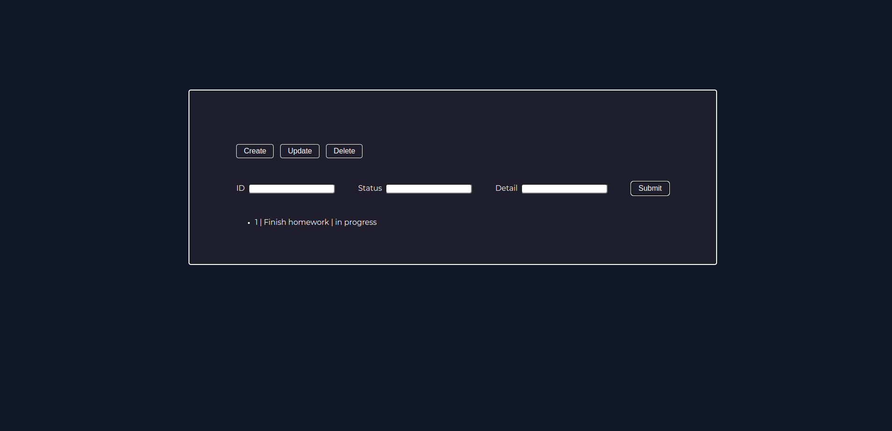

# personal-to-do-list

# Links
- [Live Preview](https://azanra.github.io/personal-to-do-list/)

# About
This project contain create, read, update, and delete 
task. The task will be created from user inputting the 
task id, task status, and task detail. Updating task
status by id and new status, Deleting id by id. 

The project focus on how to retrieve the user input, 
and create the task object based on the input. Able
to do operation to the object. and store the task
object to array of object.

# Review
- Use a class to construct the task object and method
that the task object used. As of right now the code is
really hard to navigate and understand.
- ~~- Don't put all of the script in a single file.~~ 

(Refactor) Organizing the code turns out much harder than it 
looks, Object oriented programming making it much easier to 
organize. but because i haven't deep dive into it, and if i 
want to use oop in this project require complete rewrite. 

I still have shallow understanding on it. Because of it i try 
to create invididual modules for each section of markup. And 
i organized it based on Model, View, and Controller. And 
i know it's not the correct implementation of it, it's just 
for the sake of knowing where to group the modules. 

Based on my current understanding, models is where we put or 
manipulate the data that our project will be used, view is 
what user interacting with, and last one is controller the one 
that connect the views and models, by notifying the models if the 
user interact with the view and notify the view with updated data
, as far as i know there is no one way correct implementation of 
it, and most of it used on frameworks, not really on vanilla javascript. 

# Screenshot
